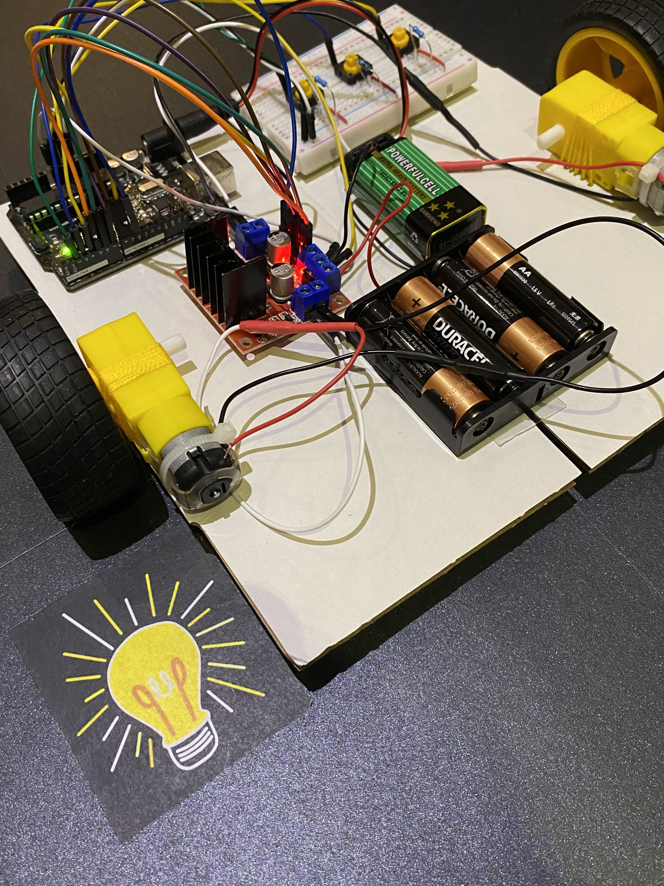
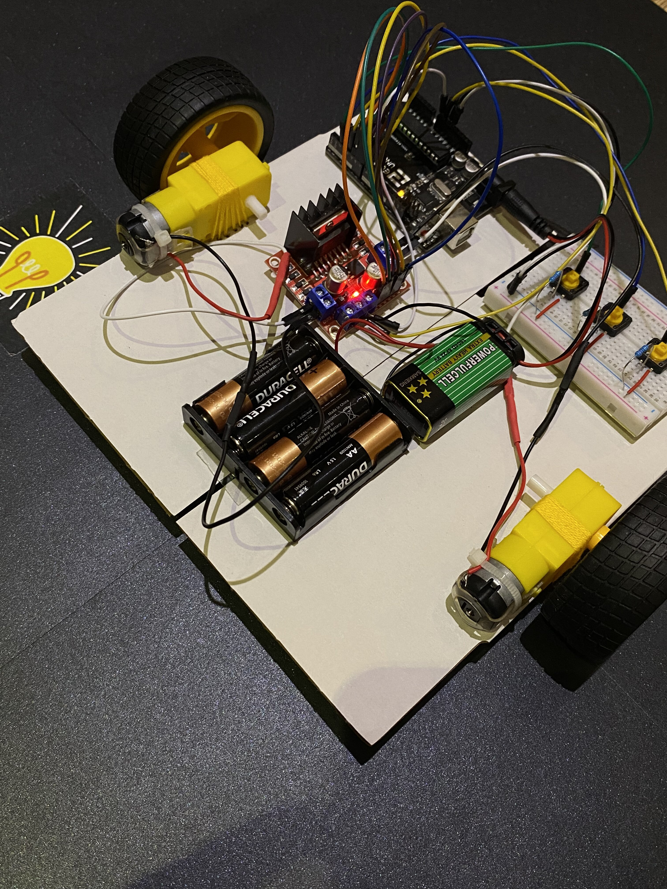

# Car V2.0 :blue_car:

## Description

This is the second version of my robot car. The breadboard on the top-right corner of the chassis has 3 push-buttons. When the first button is pushed, the car moves <b>clockwise at max speed</b>. If the second button is pushed, the car moves <b>anti-clockwise at max speed</b>. Lastly, if the third button is pushed, the car rotates <b>clockwise at half speed</b>.

I built it using a <b>breadboard with push buttons</b>, an <b>L298N motor driver</b> module for <b>pulse-width-modulation</b>, and an <b>Arduino Uno</b>.

## Visuals

[Car V2.0 In Action](https://youtube.com/shorts/pAWYJD50Z3w)

